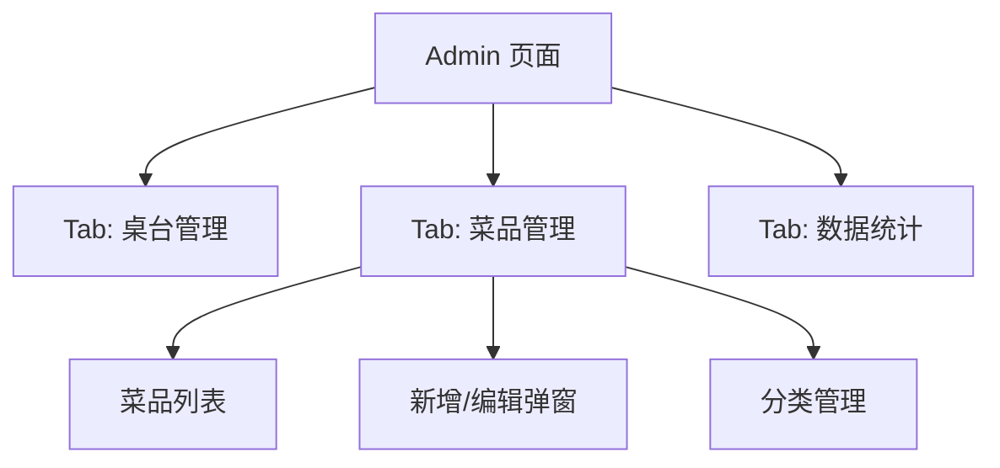
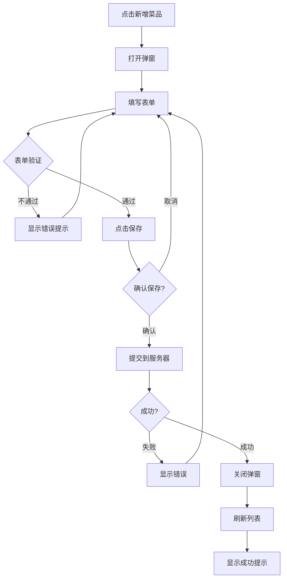
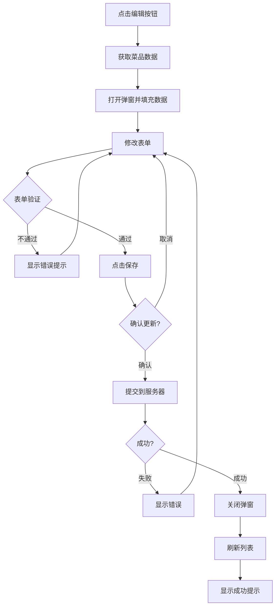
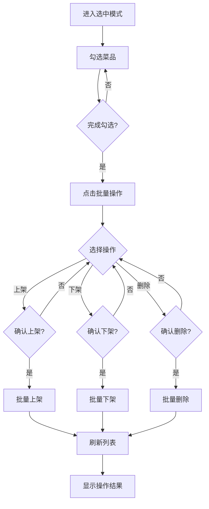

# 菜品管理功能设计文档

## 1. 数据库设计扩展

### 1.1 dishes 表字段扩展

```sql
-- 在现有 dishes 表基础上添加新字段
alter table public.dishes add column if not exists description text;
alter table public.dishes add column if not exists sort_order int default 0;
alter table public.dishes add column if not exists is_recommended boolean default false;
alter table public.dishes add column if not exists original_price numeric; -- 原价（用于促销显示）
```

### 1.2 最终表结构

```sql
create table public.dishes (
    id bigint generated by default as identity primary key,
    name varchar not null,
    description text,                          -- 菜品描述
    price numeric not null,
    original_price numeric,                    -- 原价（用于促销）
    category varchar not null,
    image_url varchar,
    options jsonb default '[]'::jsonb,         -- 例如 [{"name": "微辣", "price": 0}, {"name": "加蛋", "price": 5}]
    is_available boolean default true,         -- 上架状态
    is_recommended boolean default false,      -- 推荐菜品
    sort_order int default 0,                  -- 排序权重
    created_at timestamp with time zone default timezone('utc'::text, now()) not null,
    updated_at timestamp with time zone default timezone('utc'::text, now()) not null
);

-- 添加索引优化查询
create index idx_dishes_category on public.dishes(category);
create index idx_dishes_sort_order on public.dishes(sort_order);
create index idx_dishes_available on public.dishes(is_available);
```

---

## 2. Admin 页面布局重构

### 2.1 整体结构

```
┌─────────────────────────────────────────┐
│  餐厅管理端                              │
├────────────┬────────────────────────────┤
│            │                            │
│  🏠 桌台    │     主体内容区域           │
│  📋 菜品    │     (Tab 对应切换)         │
│  📊 统计    │                            │
│            │                            │
└────────────┴────────────────────────────┘
```

### 2.2 导航结构



### 2.3 页面 Tab 切换逻辑

```
Admin 页面状态:
├── currentTab: 'tables' | 'dishes' | 'stats'
├── 切换时自动保存当前状态
└── 刷新后保持 Tab 状态
```

---

## 3. 菜品列表页设计

### 3.1 页面布局

```
┌──────────────────────────────────────────────────┐
│  菜品管理                              [+ 新增菜品] │
├──────────────────────────────────────────────────┤
│  🔍 搜索  ┌── 全部分类 ──┐  [✓ 已上架] [✗ 已下架] │
├──────────────────────────────────────────────────┤
│  ┌─────────────────────────────────────────────┐ │
│  │  招牌红烧肉                    ¥58  [推荐]   │ │
│  │  热菜 | 已上架 | 排序: 1                   │ │
│  │  [编辑] [下架] [↑] [↓] [🗑️]                │ │
│  └─────────────────────────────────────────────┘ │
│  ┌─────────────────────────────────────────────┐ │
│  │  清炒时蔬                    ¥28            │ │
│  │  素菜 | 已上架 | 排序: 2                   │ │
│  │  [编辑] [下架] [↑] [↓] [🗑️]                │ │
│  └─────────────────────────────────────────────┘ │
│  ...                                               │
├──────────────────────────────────────────────────┤
│  [◀ 上一页]  第 1/5 页  [下一页 ▶]  共 23 道菜    │
└──────────────────────────────────────────────────┘
```

### 3.2 功能区域说明

| 区域 | 组件 | 功能 |
|------|------|------|
| 顶部操作栏 | 搜索框 | 按名称搜索 |
| 顶部操作栏 | 分类筛选 | 下拉选择，按分类筛选 |
| 顶部操作栏 | 状态筛选 | 全部/已上架/已下架 |
| 顶部操作栏 | 新增按钮 | 打开新增弹窗 |
| 菜品卡片 | 信息展示 | 名称、价格、分类、标签 |
| 菜品卡片 | 操作按钮 | 编辑、上架/下架、删除 |
| 菜品卡片 | 排序按钮 | 上移/下移 |
| 底部 | 分页 | 列表分页显示 |

### 3.3 批量操作设计

```
选中模式:
┌──────────────────────────────────────────────────┐
│  已选择 3 项                         [取消] [✓]  │
├──────────────────────────────────────────────────┤
│  [📤 批量上架] [📥 批量下架] [📁 移动分类] [🗑️ 删除] │
└──────────────────────────────────────────────────┘

操作流程:
1. 长按或点击复选框进入选中模式
2. 勾选多个菜品
3. 点击批量操作按钮
4. 确认操作
5. 执行成功提示
```

---

## 4. 新增/编辑菜品弹窗设计

### 4.1 弹窗结构

```
┌────────────────────────────────────────────────────────┐
│  新增菜品                                    [✕ 关闭] │
├────────────────────────────────────────────────────────┤
│                                                        │
│  ┌─ 基本信息 ──────────────────────────────────────┐   │
│  │  菜品名称 *                                       │   │
│  │  [输入菜品名称，如：招牌红烧肉]                    │   │
│  │                                                  │   │
│  │  菜品分类 *    [热菜 ▾]                          │   │
│  │                                                  │   │
│  │  价格设置 *                                       │   │
│  │  销售价: [¥    58   ]                            │   │
│  │  原价:   [¥       ] (可选，用于促销显示)          │   │
│  └──────────────────────────────────────────────────┘   │
│                                                        │
│  ┌─ 菜品图片 ──────────────────────────────────────┐   │
│  │  ┌─────────┐  ┌─────────┐  ┌─────────┐          │   │
│  │  │ + 上传  │  │ 预览1   │  │ 预览2   │          │   │
│  │  └─────────┘  └─────────┘  └─────────┘          │   │
│  │  支持 JPG/PNG，最大 2MB                          │   │
│  └──────────────────────────────────────────────────┘   │
│                                                        │
│  ┌─ 菜品描述 ──────────────────────────────────────┐   │
│  │  [输入菜品描述，如：肥而不腻，入口即化...]         │   │
│  │  (最多 200 字)                                   │   │
│  └──────────────────────────────────────────────────┘   │
│                                                        │
│  ┌─ 规格选项 ──────────────────────────────────────┐   │
│  │  ┌───────────────────────────────────────────┐  │   │
│  │  │  辣度         [+ 添加选项]                 │  │   │
│  │  │  ├─ 微辣     ¥0  [🗑️]                    │  │   │
│  │  │  ├─ 中辣     ¥0  [🗑️]                    │  │   │
│  │  │  └─ 重辣     ¥0  [🗑️]                    │  │   │
│  │  └───────────────────────────────────────────┘  │   │
│  │                                                  │   │
│  │  ┌───────────────────────────────────────────┐  │   │
│  │  │  加料           [+ 添加选项]               │  │   │
│  │  │  ├─ 加鹌鹑蛋   ¥5  [🗑️]                  │  │   │
│  │  │  └─ 加米饭     ¥2  [🗑️]                  │  │   │
│  │  └───────────────────────────────────────────┘  │   │
│  │                                                  │   │
│  │  [+ 添加规格组]                                  │   │
│  └──────────────────────────────────────────────────┘   │
│                                                        │
│  ┌─ 其他设置 ──────────────────────────────────────┐   │
│  │  ☑ 推荐菜品    ☑ 上架销售    排序: [   0   ]    │   │
│  └──────────────────────────────────────────────────┘   │
│                                                        │
│  ┌─ 底部按钮 ──────────────────────────────────────┐   │
│  │  [取消]                          [保存菜品]      │   │
│  └──────────────────────────────────────────────────┘   │
│                                                        │
└────────────────────────────────────────────────────────┘
```

### 4.2 规格选项数据结构

```javascript
// options 字段存储格式
{
  "specs": [
    {
      "name": "辣度",
      "required": false,
      "multi": false,
      "values": [
        { "name": "微辣", "price": 0 },
        { "name": "中辣", "price": 0 },
        { "name": "重辣", "price": 0 }
      ]
    },
    {
      "name": "加料",
      "required": false,
      "multi": true,
      "values": [
        { "name": "加鹌鹑蛋", "price": 5 },
        { "name": "加米饭", "price": 2 }
      ]
    }
  ]
}
```

### 4.3 表单验证规则

| 字段 | 规则 | 提示信息 |
|------|------|----------|
| 菜品名称 | 必填，2-30字符 | 请输入菜品名称 |
| 菜品分类 | 必填 | 请选择菜品分类 |
| 价格 | 必填，>0 | 请输入有效价格 |
| 图片 | 可选，≤2MB | 图片过大 |
| 规格选项 | 可选 | - |

---

## 5. 分类管理设计

### 5.1 分类数据结构

```sql
-- 新建分类表
create table public.categories (
    id bigint generated by default as identity primary key,
    name varchar not null unique,
    icon varchar,                              -- 图标 emoji 或 URL
    sort_order int default 0,
    is_active boolean default true,
    created_at timestamp with time zone default timezone('utc'::text, now()) not null
);

-- 默认分类数据
insert into public.categories (name, icon, sort_order) values
('热菜', '🔥', 1),
('凉菜', '🥗', 2),
('素菜', '🥬', 3),
('主食', '🍚', 4),
('汤品', '🍲', 5),
('饮料', '🥤', 6);
```

### 5.2 分类管理弹窗

```
┌─────────────────────────────────────────┐
│  分类管理                      [+ 新增分类] │
├─────────────────────────────────────────┤
│  🔥 热菜           [编辑] [🗑️] [↑] [↓]  │
│  🥗 凉菜           [编辑] [🗑️] [↑] [↓]  │
│  🥬 素菜           [编辑] [🗑️] [↑] [↓]  │
│  🍚 主食           [编辑] [🗑️] [↑] [↓]  │
│  🍲 汤品           [编辑] [🗑️] [↑] [↓]  │
│  🥤 饮料           [编辑] [🗑️] [↑] [↓]  │
├─────────────────────────────────────────┤
│  [关闭]                                   │
└─────────────────────────────────────────┘
```

---

## 6. 交互流程图

### 6.1 新增菜品流程



### 6.2 编辑菜品流程



### 6.3 批量操作流程



---

## 7. 组件设计

### 7.1 新增组件文件结构

```
src/lib/components/
├── admin/
│   ├── DishList.svelte        # 菜品列表组件
│   ├── DishCard.svelte        # 菜品卡片组件
│   ├── DishFormModal.svelte   # 新增/编辑弹窗
│   ├── CategoryManager.svelte # 分类管理组件
│   ├── BatchActions.svelte    # 批量操作栏
│   └── SearchBar.svelte       # 搜索栏组件
```

### 7.2 组件职责

| 组件 | 职责 |
|------|------|
| DishList | 渲染菜品列表，处理分页 |
| DishCard | 展示单个菜品信息，绑定操作事件 |
| DishFormModal | 完整的表单验证和提交 |
| CategoryManager | 分类的增删改查 |
| BatchActions | 批量操作按钮和确认 |
| SearchBar | 搜索和筛选逻辑 |

---

## 8. API 设计

### 8.1 Server Actions

```javascript
// src/routes/admin/dishes/+page.server.js

export const actions = {
    // 获取菜品列表
    list: async ({ request, locals }) => {
        const formData = await request.formData();
        const category = formData.get('category');
        const search = formData.get('search');
        const status = formData.get('status');
        const page = parseInt(formData.get('page') || '1');
        const pageSize = 20;
        
        // 构建查询...
        return { dishes, total, page, pageSize };
    },
    
    // 新增菜品
    create: async ({ request, locals }) => {
        const formData = await request.formData();
        // 验证和插入...
        return { success: true };
    },
    
    // 更新菜品
    update: async ({ request, locals }) => {
        const formData = await request.formData();
        const id = formData.get('id');
        // 更新逻辑...
        return { success: true };
    },
    
    // 删除菜品
    delete: async ({ request, locals }) => {
        const formData = await request.formData();
        const id = formData.get('id');
        // 删除逻辑...
        return { success: true };
    },
    
    // 批量操作
    batch: async ({ request, locals }) => {
        const formData = await request.formData();
        const action = formData.get('action');
        const ids = JSON.parse(formData.get('ids'));
        // 批量逻辑...
        return { success: true, affected: ids.length };
    },
    
    // 更新排序
    reorder: async ({ request, locals }) => {
        const formData = await request.formData();
        const moves = JSON.parse(formData.get('moves'));
        // 排序逻辑...
        return { success: true };
    }
};
```

---

## 9. 实现优先级

### Phase 1: 基础功能
- [ ] 数据库字段扩展
- [ ] Admin 页面 Tab 切换
- [ ] 菜品列表展示
- [ ] 新增/编辑菜品弹窗
- [ ] 单个菜品上下架

### Phase 2: 增强功能
- [ ] 搜索和筛选
- [ ] 批量操作
- [ ] 分类管理
- [ ] 图片上传

### Phase 3: 优化体验
- [ ] 排序拖拽
- [ ] 快捷键支持
- [ ] 数据统计

---

## 10. 下一步行动

请确认以上设计方案，我将开始实现：

1. **创建数据库迁移脚本**
2. **重构 Admin 页面添加 Tab**
3. **实现菜品列表组件**
4. **实现新增/编辑弹窗**
5. **实现批量操作功能**

是否需要调整或补充任何细节？
